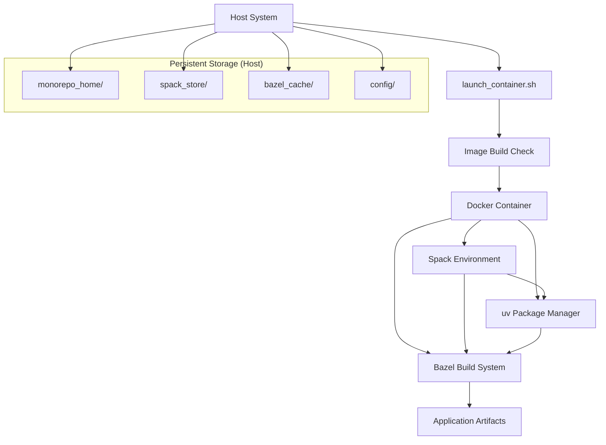
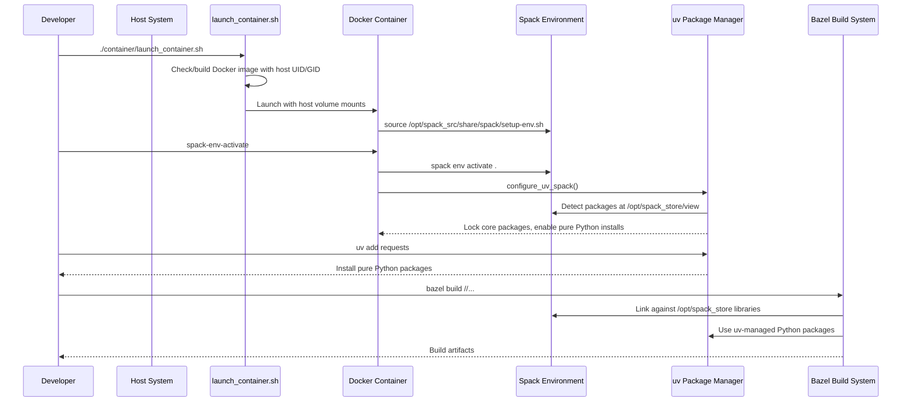
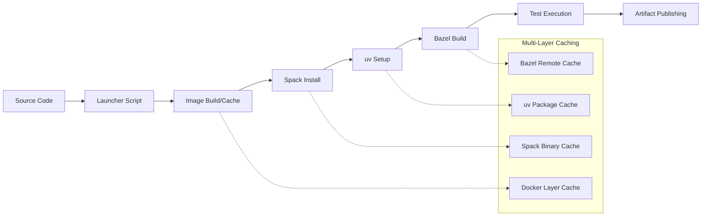

# Sygaldry: Bazel + Spack + Docker Build System
## System Design Document

**Version:** 2.1  
**Date:** 2026-01-27  
**Status:** Current Implementation

---

## Table of Contents

1. [Executive Summary](#executive-summary)
2. [System Overview](#system-overview)
3. [Architecture](#architecture)
4. [Component Design](#component-design)
5. [Build Flow](#build-flow)
6. [Dependency Management](#dependency-management)
7. [Data Flow](#data-flow)
8. [Security Considerations](#security-considerations)
9. [Operational Considerations](#operational-considerations)
10. [Performance & Scalability](#performance--scalability)
11. [Monitoring & Observability](#monitoring--observability)
12. [Future Considerations](#future-considerations)

---

## Executive Summary

Sygaldry is a hermetic, reproducible build system designed for multi-language monorepos requiring complex scientific computing dependencies. The system combines three key technologies:

- **Docker** for environment isolation and reproducibility
- **Spack** for HPC/scientific library dependency management  
- **Bazel** for fast, incremental mixed-language builds

### Key Benefits

- **Hermetic Builds**: Complete isolation from host system dependencies
- **Reproducibility**: Deterministic builds across development and CI environments
- **Performance**: Aggressive caching at multiple layers (Docker, Spack, Bazel)
- **Multi-Language Support**: Seamless Python, C++, and Rust integration
- **Scientific Computing Focus**: Native support for HPC libraries (MPI, CUDA, HDF5, etc.)
- **Dynamic User Mapping**: Container user matches host UID/GID for perfect file permissions
- **Intelligent Caching**: uv integrates with Spack for optimal Python package management

---

## System Overview

### Problem Statement

Traditional build systems struggle with:
- Complex scientific computing dependencies with specific version requirements
- Cross-platform reproducibility for HPC environments
- Mixed-language monorepos with tight integration requirements
- Long build times due to heavyweight dependencies
- Environment contamination from host system libraries

### Solution Approach

Sygaldry addresses these challenges through a three-tier architecture:

1. **Container Layer (Docker)**: Provides OS-level isolation and reproducible runtime environment
2. **Dependency Layer (Spack)**: Manages external scientific/HPC libraries with precise version control
3. **Build Layer (Bazel)**: Orchestrates fast, incremental builds of application code
4. **Python Layer (uv)**: Modern Python package management with Spack integration

---

## Architecture

### High-Level Architecture

```
┌─────────────────────────────────────────────────────────────┐
│                        Host System                          │
│                    (Any UID/GID)                            │
├─────────────────────────────────────────────────────────────┤
│  Shared Host Storage (Project Isolated)                    │
│  /mnt/data_infra/zephyr_container_infra/<project_id>/       │
│  ├─ monorepo_home/      → Container /home/kvothe            │
│  ├─ spack_store/        → Container /opt/spack_store        │
│  ├─ bazel_cache/        → Container /opt/bazel_cache        │
│  └─ config/             → Configuration files               │
├─────────────────────────────────────────────────────────────┤
│                   Docker Container                          │
│           User: kvothe (Host UID/GID)                       │
│  ┌───────────────┬───────────────┬─────────────────────┐    │
│  │ Spack Layer   │ Bazel Layer   │ Application Layer   │    │
│  │               │               │                     │    │
│  │ • HPC Libs    │ • Build Rules │ • Python (uv)       │    │
│  │ • CUDA/GPU    │ • Toolchains  │ • C++ Libraries     │    │
│  │ • PyTorch     │ • Multi-Cache │ • Rust Crates       │    │
│  │ • NumPy/SciPy │ • Sandboxing  │ • Mixed Targets     │    │
│  └───────────────┴───────────────┴─────────────────────┘    │
└─────────────────────────────────────────────────────────────┘
```

### Component Interaction



---

## Component Design

### 1. Container Layer (Docker)

**Responsibilities:**
- Environment isolation and reproducibility
- Dynamic user mapping (host UID/GID → container user)
- GPU access management with NVIDIA runtime
- Intelligent volume mounting for persistent caches
- Automatic image building and caching

**Key Components:**
- `dev_container.dockerfile`: Ubuntu 24.04 + development stack
- `launch_container.sh`: Comprehensive launcher with auto-build
- Dynamic user creation with exact host UID/GID mapping

**Design Decisions:**
- Ubuntu 24.04 LTS base (headless, no GUI components)
- Dynamic UID/GID mapping for seamless file permissions
- Shared host storage root at `/mnt/data_infra/zephyr_container_infra`
- Automatic Docker image building with change detection
- GPU support auto-detection and configuration

### 2. Dependency Layer (Spack)

**Responsibilities:**
- External dependency resolution and installation
- Scientific computing library management
- Cross-platform binary compatibility
- Dependency conflict resolution

**Key Components:**
- `spack.yaml`: Environment specifications with unified concretization
- `spack.lock`: Lockfiles for reproducible installs
- Spack view: Unified dependency tree at `/opt/spack_store/view`
- Spack source: Baked into image at `/opt/spack_src`

**Design Decisions:**
- Unified concretization for consistent dependency resolution
- View-based integration at `/opt/spack_store` for Bazel/uv consumption
- Spack repository pinned and baked into the image (`SPACK_VERSION=v1.1.0`)
- Separate environments for different use cases (tools, CUDA packages)
- Integration with uv for Python package management

### 3. Build Layer (Bazel)

**Responsibilities:**
- Fast, incremental builds
- Multi-language toolchain management (Python, C++, Rust, Go)
- Build sandboxing and hermeticity
- Aggressive caching at `/opt/bazel_cache`

**Key Components:**
- `WORKSPACE`: External dependency declarations
- `BUILD` files: Target definitions per package
- `third_party/BUILD.spack`: Spack dependency integration
- Persistent cache at `/opt/bazel_cache`

**Design Decisions:**
- Persistent caching with host volume mounts
- Sandboxed builds for hermeticity
- Mixed-language rules for Python/C++/Rust integration
- Bazel 6.4.0+ for modern features and performance

### 4. Python Package Management (uv)

**Responsibilities:**
- Fast Python package installation and management
- Integration with Spack-installed scientific packages
- Pure Python dependency resolution
- Development tool management

**Key Components:**
- `uv` binary installed in container
- Integration function `configure_uv_spack()`
- Cache at `/opt/bazel_cache/uv`
- Automatic Spack package detection

**Design Decisions:**
- Reuses Spack packages for core scientific libraries (locked)
- Handles pure Python packages efficiently
- Integrated with Spack environment activation
- Shared cache with Bazel for storage efficiency

**Integration Strategy:**
- **Spack Packages (Locked)**: numpy, scipy, torch, pandas, matplotlib
- **uv Packages (Free)**: requests, click, pydantic, development tools
- **Environment Variables**: `UV_NO_BUILD_ISOLATION_PACKAGE`, `UV_FIND_LINKS`

---

## Build Flow

### Development Workflow



### CI/CD Pipeline



---

## Dependency Management

### Dependency Categories

1. **System Dependencies** (Docker layer)
   - OS packages (build-essential, git, curl)
   - Runtime libraries (libc, libssl)
   - Language runtimes (Python 3.13)

2. **External Libraries** (Spack layer)
   - Scientific computing (NumPy, SciPy)
   - HPC libraries (MPI, HDF5, Boost)
   - GPU computing (CUDA, CuDNN)

3. **Application Code** (Bazel layer)
   - Python packages
   - C++ libraries
   - Rust crates
   - Cross-language bindings

### Version Management Strategy

- **Docker**: Pinned base image tags
- **Spack**: Lockfiles (`spack.lock`) for exact version reproduction
- **Bazel**: External dependency pinning in `WORKSPACE`

### Conflict Resolution

1. **Spack Unified Concretization**: Ensures single version per dependency across environment
2. **Bazel Dependency Resolution**: Explicit version override mechanisms
3. **Container Isolation**: Prevents host system contamination

---

## Data Flow

### Build Artifacts

```
Source Code (Host)
    ↓
Docker Container
    ↓
Spack Dependencies (/opt/spack/view)
    ↓
Bazel Build System
    ↓
Application Artifacts
    ↓
Host Output Directory
```

### Cache Hierarchy

1. **Docker Layer Cache**: OS packages and base environment
2. **Spack Binary Cache**: Compiled scientific libraries
3. **Bazel Cache**: Incremental build artifacts and test results
4. **Container Registry**: Pre-built environment images

### Data Persistence

- **Host Volumes**: Shared host directories for cross-session persistence
- **Container State**: Ephemeral, recreated from reproducible specifications
- **Cache Sharing**: Multi-developer team cache synchronization via remote backends

---

## Security Considerations

### Container Security

- **Dynamic User Mapping**: Container user matches exact host UID/GID
- **Minimal Attack Surface**: Ubuntu 24.04 LTS base, no GUI components
- **Network Isolation**: Host network access only when required
- **Resource Limits**: CPU/memory constraints via Docker
- **Conflict Resolution**: Automatic handling of existing UID/GID conflicts

### Dependency Security

- **Trusted Sources**: Official Spack packages and verified repositories
- **Vulnerability Scanning**: Automated scanning of base images and dependencies
- **Isolation**: Sandboxed builds prevent supply chain attacks
- **Reproducible Builds**: Cryptographic verification of build reproducibility

### Access Control

- **Volume Mounts**: Read-only mounts where possible
- **Secrets Management**: Environment variables and mounted secrets
- **GPU Access**: Controlled NVIDIA runtime exposure

---

## Operational Considerations

### Local Development

**Prerequisites:**
- Docker daemon running
- NVIDIA Docker runtime (optional, for GPU support)
- 50GB+ available disk space for caches
- 16GB+ RAM for large builds

**Launcher Script Features:**
- Automatic Docker image building with change detection
- Shared host storage root for project isolation
- Project isolation (multiple projects supported)
- Dynamic UID/GID mapping
- GPU auto-detection and configuration
- Comprehensive logging and error handling

**Setup Time:**
- Initial container build: 15-25 minutes (includes all toolchains)
- Spack environment setup: 30-60 minutes (first time)
- Subsequent launches: <10 seconds
- Image rebuilds: 5-15 minutes (when Dockerfile changes)

### CI/CD Integration

**Caching Strategy:**
- Docker layer caching for base environment
- Spack binary cache for external dependencies at `/opt/spack_store`
- Bazel persistent cache at `/opt/bazel_cache`
- uv package cache integrated with Bazel cache
- Intelligent image rebuild detection

**Build Times:**
- Cold build (first time): 60-120 minutes
- Warm build (cached): 5-15 minutes
- Incremental build: 10 seconds - 5 minutes
- Container launch: 3-10 seconds
- Image rebuild: 10-20 minutes (when needed)

### Resource Requirements

**Development Environment:**
- CPU: 8+ cores recommended
- RAM: 16GB+ (32GB for large projects)
- Storage: 100GB+ for full cache hierarchy
- GPU: NVIDIA GPU for CUDA workloads

**CI/CD Environment:**
- CPU: 16+ cores for parallel builds
- RAM: 32GB+ for large link operations
- Storage: 500GB+ for build cache and artifacts

---

## Performance & Scalability

### Build Performance

**Parallelization:**
- Spack: Parallel package builds
- Bazel: Parallel action execution
- Docker: Multi-stage build optimization

**Caching Effectiveness:**
- Cache hit ratio target: >80% for incremental builds
- Remote cache latency: <100ms for cache queries
- Local cache size: 10-50GB typical, 100GB+ for large projects

### Scalability Limits

**Horizontal Scaling:**
- Multiple developers sharing remote caches
- CI/CD farm with distributed build execution
- Cross-platform cache sharing (Linux, macOS, Windows)

**Vertical Scaling:**
- Build parallelism scales with available CPU cores
- Memory requirements grow with dependency complexity
- Storage needs scale with cache retention policies

---

## Monitoring & Observability

### Build Metrics

- Build duration and success rates
- Cache hit ratios across layers
- Resource utilization (CPU, RAM, disk I/O)
- Dependency resolution times

## Human + Agent Ergonomics

### Human Ergonomics Goals

- One-line commands for common workflows (Spack build, uv install, HF download)
- Clear defaults and predictable cache locations
- Minimal environment variables to get started

### Agent Ergonomics Goals

- Structured JSONL logs for low-token monitoring
- Stable status files with last-known state
- Deterministic paths for introspection and triage

### Job Runner Pattern

- Host-side runner: `tools/zephyr_job`
- Status: `/mnt/data_infra/zephyr_container_infra/<project_id>/bazel_cache/zephyr_jobs/<job>.status`
- Logs: `/mnt/data_infra/zephyr_container_infra/<project_id>/bazel_cache/zephyr_jobs/<job>-<timestamp>.jsonl`

This enables frequent, low-cost polling without streaming full logs.

### Health Checks

- Container startup validation
- Spack environment consistency checks
- Bazel workspace integrity verification
- Cache corruption detection

### Debugging Tools

- Verbose build logging
- Dependency graph visualization
- Build performance profiling
- Cache inspection utilities

---

## Future Considerations

### Short-term Roadmap (3-6 months)

1. **Cross-language Integration Examples**
   - Python-Rust FFI bindings
   - C++ Python extensions
   - Mixed-language test frameworks

2. **Enhanced Caching**
   - Remote Spack binary cache
   - Distributed Bazel caching
   - Cross-platform cache sharing

3. **Developer Experience**
   - IDE integration (VS Code devcontainers)
   - Hot reloading for development
   - Improved error messaging

### Medium-term Roadmap (6-12 months)

1. **Multi-platform Support**
   - ARM64 container images
   - macOS development environments
   - Windows WSL2 compatibility

2. **Advanced Features**
   - Incremental Spack rebuilds
   - Build artifact signing
   - Dependency vulnerability scanning

3. **Ecosystem Integration**
   - GitHub Actions workflows
   - GitLab CI/CD pipelines
   - Jenkins integration

### Long-term Vision (12+ months)

1. **Cloud-native Deployment**
   - Kubernetes-based build farms
   - Serverless build execution
   - Auto-scaling based on demand

2. **Advanced Optimization**
   - Machine learning-driven cache optimization
   - Predictive dependency prefetching
   - Build time optimization recommendations

3. **Enterprise Features**
   - Multi-tenancy support
   - Advanced access controls
   - Compliance and audit logging

---

## Implementation Details

### Launcher Script (`launch_container.sh`)

The launcher script is the primary interface to the Sygaldry system, providing a comprehensive development environment setup:

**Core Features:**
- **Shared Host Storage**: Uses `/mnt/data_infra/zephyr_container_infra/<project_id>/` for isolation
- **Auto Image Building**: Detects Dockerfile changes and rebuilds automatically
- **Dynamic User Mapping**: Maps host UID/GID to container user for perfect file permissions
- **GPU Auto-Detection**: Configures NVIDIA runtime when available
- **Comprehensive Logging**: Detailed logging with caller information for debugging

**Workflow:**
1. **System Validation**: Checks Docker daemon, NVIDIA runtime availability
2. **Environment Setup**: Creates host directories for caches and config
3. **Image Management**: Builds or rebuilds Docker image as needed
4. **Container Launch**: Dispatches an entrypoint script and launches container

**Environment Variables:**
- `SYGALDRY_PROJECT_ID`: Custom project identifier
- `SYGALDRY_IMAGE`: Override default image name  
- `SYGALDRY_GPU`: Enable/disable GPU support
- `BAZEL_VERSION`, `PYTHON_VERSION`, etc.: Control tool versions

### Container Image (`dev_container.dockerfile`)

**Base Configuration:**
- Ubuntu 24.04 LTS (headless, no GUI components)
- CUDA 12.9.1 + cuDNN base image for GPU workloads
- Dynamic user creation with host UID/GID via build args
- Multi-language toolchain: Python 3.13, Rust 1.79, Go 1.21.5, Bazel 6.4.0

**Key Features:**
- **Conflict Resolution**: Removes existing users/groups with target UID/GID
- **Tool Integration**: Pre-configured uv, Spack dependencies, development tools
- **Security**: Non-root execution, sudo access for development convenience
- **Optimization**: Aggressive APT cleanup, layer caching optimization

---

## Conclusion

The Sygaldry build system provides a production-ready foundation for complex, multi-language scientific computing projects. The implementation combines Docker's isolation, Spack's dependency management, Bazel's build performance, and uv's Python package management into a unified developer experience.

**Key Achievements:**
- **Zero-Configuration Setup**: Single script launch with automatic environment setup
- **Perfect File Permissions**: Dynamic UID/GID mapping eliminates permission issues
- **Multi-Project Support**: Shared host storage root enables multiple isolated projects
- **Intelligent Caching**: Four-tier caching (Docker, Spack, Bazel, uv) for optimal performance
- **Scientific Computing Ready**: Optimized for ML/HPC workloads with GPU support

The system successfully addresses the complexity of scientific computing dependencies while maintaining the speed and reliability required for modern development workflows. The comprehensive launcher script and container implementation provide a robust foundation that scales from individual development to large team environments.
